# PF1 Lighting

A complete overhaul of foundry's lighting system to match pathfinder 1e's rules on lighting.

**Manifest URL:** `https://github.com/Hamilcarbarcas/pf1-lighting/releases/latest/download/module.json`

## Requirements
- Foundry VTT v13
- PF1e system v11.10

## Contents

- [Core features](#core-features)
  - [New lighting model](#new-lighting-model)
    - [Discrete levels](#discrete-levels)
    - [Umbras](#umbras)
    - [Vision mode reworks](#vision-mode-reworks)
      - [Sightless](#sightless)
  - [Light sources](#light-sources)
    - [Darkness sources](#darkness-sources)
  - [Presets](#presets)
  - [Light effects](#light-effects)
    - [The token light button](#the-token-light-button)
    - [Fuel](#fuel)
    - [Light on an item](#light-on-an-item)
    - [What is lit on this scene](#what-is-lit-on-this-scene)
  - [Overlapping increases](#overlapping-increases)
  - [Ambient lighting changes](#ambient-lighting-changes)
    - [Interior regions](#interior-regions)
      - [Light spill](#light-spill)
  - [Light level tooltip](#light-level-tooltip)
  - [Token Vision](#token-vision)
- [Configuration](#configuration)
  - [Edit Light Sources](#edit-light-sources)
  - [Edit Presets](#edit-presets)
  - [Light Spill](#light-spill-1)
  - [Visuals](#visuals)
- [Compatibility](#compatibility)
- [Performance](#performance)
- [More](#more)

# Core features

- Light levels are now defined as discrete values (supernatural dark, dark, dim, normal, bright)
- Light sources can increase light levels in addition to static light values
- Darkness sources reduce light levels
- Magical darkness reduces the brightness of areas viewed through it
- Mundane lights have no effect within magical darkness sources
- Magical daylight cancels darkness effects in its area
- Indoor spaces can be defined that ignore ambient lighting
- Low-light vision, Darkvision, See in Darkness, True Seeing and Blindsight all tooled to work RAW
- Creatures with vision can be marked **Sightless** and perceive only by their other senses (scent, blindsight, etc.)
- Token lighting based on light-producing items, including limited use time and fuel constraints.

## New lighting model

The lighting model has been reworked. The scene's lighting is now determined by an underlying model that
calculates the light level across the scene (from the perspective of selected tokens if eligible) based
on scene lighting and light/darkness sources, accounting for any special vision modes the selected token(s)
may have. This model is then rendered, giving each zone its configured brightness and blending
transitions between light levels. Light source colors and animations are preserved and rendered as well.

Token vision is also modified by the model, hiding any tokens that cannot be seen based on lighting 
conditions and vision modes. This is a subtractive process, and does not inhibit Foundry hiding tokens 
based on line of sight or invisibility.

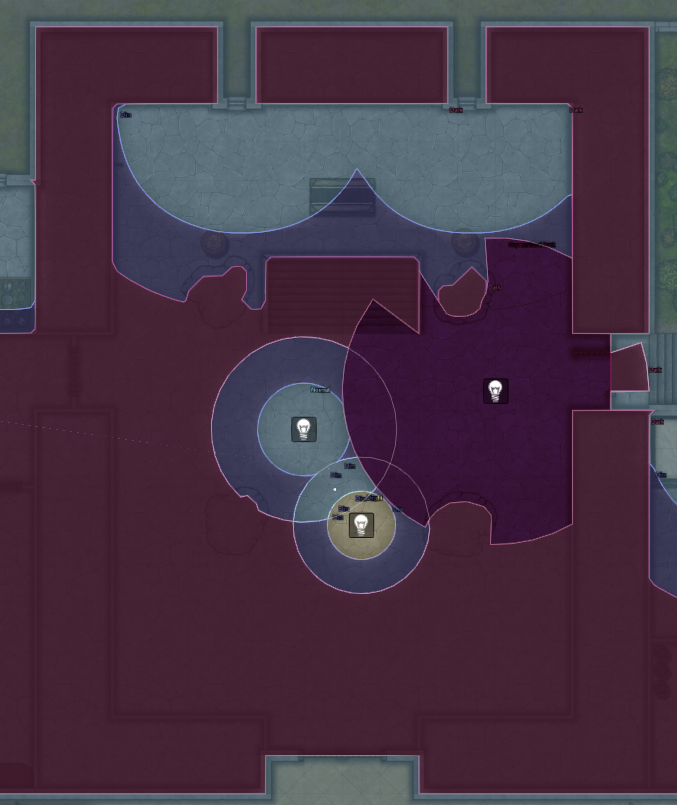

### Discrete levels

| Light Level | Examples |
| --- | --- |
| **Bright** | Full daylight, daylight spell |
| **Normal** | Torchlight, light spells |
| **Dim** | Shadowy illumination, darkness spells |
| **Dark** | dark rooms, darkness spells |
| **Supernatural Dark** | *Deeper darkness* |

All lighting is built on these levels. Light sources can set or increase levels, darkness sources can
set or reduce levels.

Light levels are absolute brightness, not a brightening effect. In core foundry, lights become brighter
or dimmer based on global illumination levels (bright light in a dark scene is darker than bright light
in a bright scene). Now each level has a set brightness, and global illumination instead sets the
baseline level for the scene.

### Umbras

Looking **through** a magical darkness lowers the light level of everything past it to the darkness's
own level. A lit room seen through a *darkness* is as dark as the spell area, and a creature with
ordinary sight cannot see tokens or scene areas beyond an area reduced to dark by a magical darkness.
Standing **inside** an area of magical darkness shadows every direction - the umbra is 360°.

Non-magical darkness sources have no umbra, and only affect the area within their radius.

This behavior can be turned off via `Magical darkness casts shadows` in the mod settings.

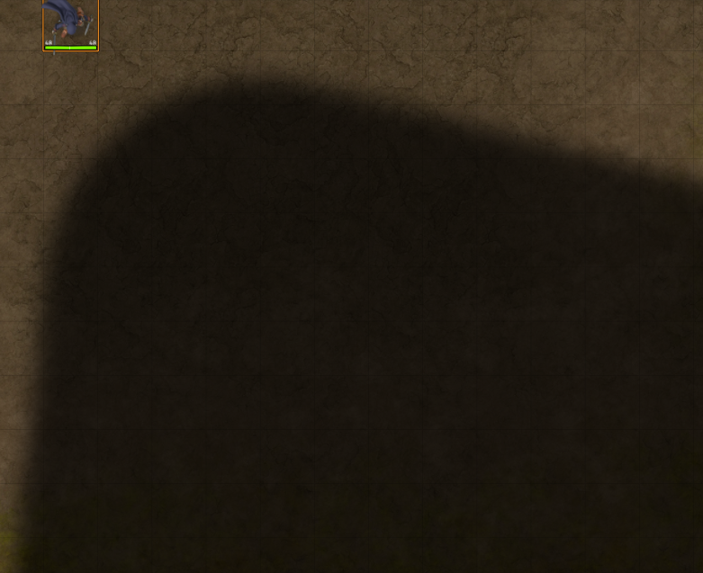

### Vision mode reworks

- **Darkvision** reveals all areas of non-magical darkness within its radius and renders them in
greyscale
- **Low-Light Vision** multiplies the radius of all light sources by the configured multiplier and 
reads ambient dim light as normal light ("Characters with low-light vision can see outdoors on a 
moonlit night as well as they can during the day"). LLV no longer multiplies the radius of darkness
sources.
- **Blindsight** reveals all areas of magical or non-magical darkness within its radius and renders
them in greyscale. This is an additive reveal - a blindsighted creature still sees lit areas at any 
distance in normal color. Blindsight is not suppressed by the blinded condition.
- **True Seeing** reveals all areas regardless of light level within its radius, rendering them normally.
- **See in Darkness** reveals all areas in view regardless of light level, rendering them normally.
- **Normal Vision** hides all areas in darkness or magical darkness, as well as all tokens within those
areas.
- **Sightless** blocks all vision provided by sight. This includes normal vision, darkvision, low-light
vision, true seeing, see invisibility and see in darkness. Any sight provided by other senses (such 
as blindsight) is provided in greyscale, like darkvision provides.

## Light sources
Light sources now have a **Lighting Configuration** section. Some existing controls have been moved 
into this section.

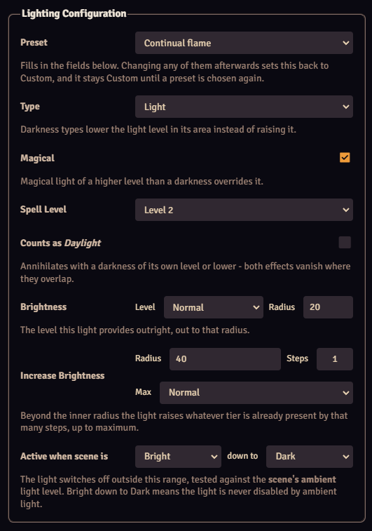

| Control | What it does |
| --- | --- |
| **Preset** | Apply a preset configuration |
| **Type** | Sets the source as a light source or darkness source|
| **Magical** | Magical light overrides darkness sources of lower levels |
| **Spell Level** | Set the spell level of the light effect, if magical |
| **Counts as *Daylight*** | use *daylight's* magical darkness cancelling rules for this light source |
| **Brightness** | The level this light provides outright, and the radius it provides it to |
| **Increase Brightness** | Raises the ambient light level within a given radius |
| **Active when scene is**| Set the ambient lighting window in which the source is active |

Lights can set a static light level within a certain radius, and modify the light level within a second
radius. This allows for pathfinder's rules for most light sources (e.g. Torches provide
normal light in a 20 foot radius and increase the light level by 1 step in a 40 foot radius, to a
maximum of normal light).

Light sources only increase light levels, and never decrease them. A light source set to provide normal
light in an area of bright light has no visible effect.

*Active when scene is* is the replacement for Foundry's *Darkness Activation Range*. It keys strictly
off the scene's configured light level, not the localized light level where the source is.

Selecting a preset is an instantaneous change to the light source. The source does not remain fixed
to the preset values, and changing said preset has no effect on any lights already configured by it.

### Darkness sources

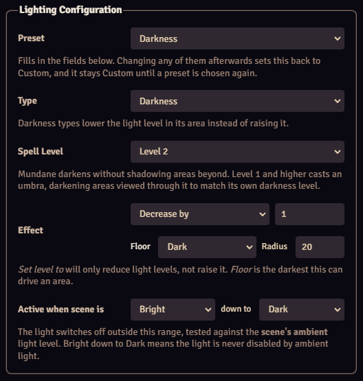

| Control | What it does |
| --- | --- |
| **Preset** | Apply a preset configuration |
| **Type** | Sets the source as a light source or darkness source|
| **Spell Level** | Set the spell level of the darkness effect. *Mundane* is non-magical darkness |
| **Effect** | *Decrease by* n steps, or *Set level to* a specified level, along with the darkness 
floor and effect radius |
| **Active when scene is**| Set the ambient lighting window in which the source is active |

Darkness suppresses all light sources of an equal or lower level. A light source whose center is 
contained within a suppressing darkness source emits no light.

**Decrease by** reduces the light level in the area by the given number of steps. Light sources
are suppressed prior to this reduction, so if the area includes normal light from a torch lighting
a dim room, the light level is reduced from dim rather than normal. **Set level to** overrides the
current light level and sets it to the given value.

Darkness sources do not have multi-tiered effects; they only use one radius.

Darkness sources spread their effect the same way light sources do - they are blocked by walls that 
block light just as a light source is. They are similarly not visible when outside a token's vision.
A darkness source does not show up in a token's fog as they do in core Foundry.

Animations for darkness sources render, but not do not blend as well as in core Foundry.

## Presets

Eleven presets ship with the module:

| Preset | Values |
| --- | --- |
| Candle | +1 step to 5 ft |
| Torch | normal to 20 ft, +1 to 40 |
| Lamp, common | normal to 15 ft, +1 to 30 |
| Lantern, bullseye | normal to 60 ft, +1 to 120 |
| Lantern, hooded | normal to 30 ft, +1 to 60 |
| Sunrod | normal to 30 ft, +1 to 60 |
| *Continual flame* | magical, level 2 - normal to 20 ft, +1 to 40 |
| *Light* | magical, cantrip - normal to 20 ft, +1 to 40 |
| *Daylight* | magical, level 3 - bright to 60 ft, +1 to 120, counts as daylight |
| *Darkness* | magical, level 2 - one step down for 20 ft, floor of Dark |
| *Deeper darkness* | magical, level 3 - two steps down for 60 ft, floor of Supernatural Dark |

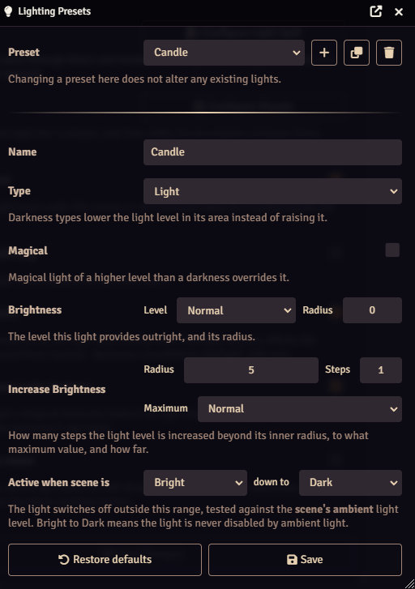

Each preset also carries an **appearance** - color, strength, falloff and animation - so a torch
flickers orange and a sunrod glows cold and steady without any further setup.

Presets can be edited, added, or removed in the mod's settings. If presets have been manually edited,
they will not be replaced or updated when the mod updates.

- **Editing a preset does not change lights already placed from it.** A preset fills fields in at the
  moment you choose it and is never read again afterwards.
- **Deleting one is harmless.** A light placed from a preset that no longer exists reads as Custom and
  renders as previously configured.
- **A preset can carry an activation range, and by default does not.** Leaving *Active when scene is*
  spanning Bright to Dark and applying the preset will not disturb a range you set by hand.

## Light effects

Token or object based lighting that can be driven by light producing items in a token's inventory.
These settings do not interfere with any configuration in the token's settings.

### The token light button

Adds a **light bulb** button to the HUD of tokens.

- **Click** it to open the light effect selector, or disable any current light sources if active.
- **Right-click** opens the selector whether or not something is already lit, allowing to hot-swap
between lighting effects.

The selector lists **the light sources on that actor** - the torches, lanterns, etc. in its
inventory - with the fuel remaining beside each. A source you have no fuel for is shown greyed out
rather than hidden, so the lantern in your hand does not silently vanish from the list.

While **Fuel use** is set to *ignore fuel* (default on), no counts are shown and nothing is ever 
greyed out - everything in the list is lightable.

A GM gets one extra row at the top, **Any light source…**, which offers every preset and
ignores inventory and fuel entirely.

A player whose actor is carrying nothing that gives light gets no button.

### Fuel

A light burns its fuel in game time. Partial use is tracked on fuel items (which may be the light
item itself, such as with torches).

Fuel costs can be configured in the mod settings:

| Option | Effect |
| --- | --- |
| **Ignore fuel** (default) | Fuel is ignored |
| **Chat message only** | Nothing is taken. A message reports what was used, and you remove it by hand |
| **Remove fuel silently** | Fuel comes off the sheet with no message |
| **Remove fuel with chat message** | Both |

If fuel is set to be removed automatically, lights are extinguished when fuel is exhausted.

A stack of fuel that runs out is set to zero rather than deleted.

Many basic light items are already configured to be recognized by this system. **Edit Light Sources** 
in the mod's settings allows for custom registration of more items.

### Light on an item

Items can be configured individually as light sources directly on the item as well, on the **Advanced** 
tab of its item sheet:

| Control | What it does |
| --- | --- |
| **Emits light** | Whether this item gives off light |
| **Light preset** | Which preset it gives off |
| **Fuel** | The item consumed while it burns, and how long one item lasts |

A blank fuel field defaults to a light source that works indefinitely.

Settings on an item override any configuration for said item name in the mod settings.

The same section appears on **buffs**, and applies whenever the buff is active.

### Light Effects Menu

The **lighting controls** section has a new button that opens a list of every light effect on the 
current scene - what it is on, what it emits, its source, what fuel it uses, and when it ends. 
Clicking an entry's name pans to it; the **×** disables that light source.

## Overlapping increases

Overlapping regions that increase a light level stack, up to the cap configured on each light source.
For example, torches increase the light level one step to a radius of 40 feet (to a maximum of normal
light). If two torches on a dark scene have overlapping areas, that area is increased two steps,
providing normal light.

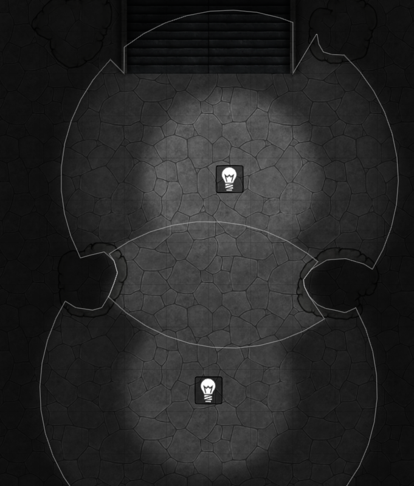

## Ambient lighting changes

As the new lighting model operates at discrete light levels, the scene config's **Lighting** tab now 
has a **Light level** dropdown - Bright, Normal, Dim or Dark - in place of Foundry's darkness slider.

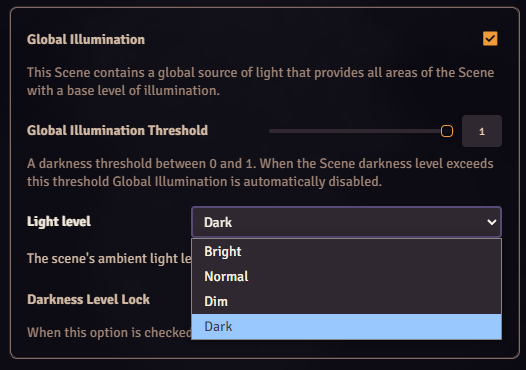

**lighting controls** now has four buttons to set the ambient level - *Set ambient light to Bright / 
Normal / Dim / Dark* - replacing Foundry's *Transition to Daylight* and *Transition to Darkness*. 
They change the scene instantaneously rather than as a gradual transition.

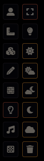

A scene with **darkness locked** shows no buttons, as Foundry refuses changes to it. 

### Interior regions

Added a new **region** behavior, **Restrict Global Illumination**, allowing modification of the ambient
lighting conditions within its area with options for **Light Level** and **Mode**.

 - **Maxium** sets a the selected light level as the region's ceiling, blocking ambient light from
 increasing it beyond this level
 - **Minimum** sets the selected light level as the region's floor, blocking ambient light from
 reducing it beyond this level
 - **Set to** overrides the scene's ambient light within the region, setting it to the selected light
 level instead.

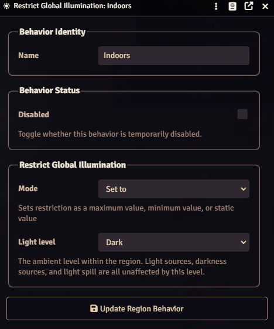

This region behavior only impacts the ambient light level, and has no effect on any light or darkness
sources within it.

Core's own *Adjust Darkness Level* behavior is untested will likely currently not behave well with this 
mod.

#### Light spill

An optional feature, **Light Spill** allows light to enter an interior region through windows and open
doors (or any wall that does not block light).

A wall counts as an opening if its **Light** restriction is *None*, *Proximity* or *Reverse
proximity*.

This light spreads from an opening rather than providing sharp lines the way normal light sources do.
It will spread around corners and fill the space, reducing in brightness the further it gets from its
source, more closely mirroring natural difused light.

- A darkness over the window dims what comes through it.
- If the ambient light is not brighter than the room, light spill is not computed.
- A light source outside a window does not trigger light spill - it casts its light through as normal.
- Multiple windows in a room are calculated in one pass.

Light spill is treated as global illumination by everything else in the module - the readout, what a 
creature can see, perception, and any darkness sources covering it.

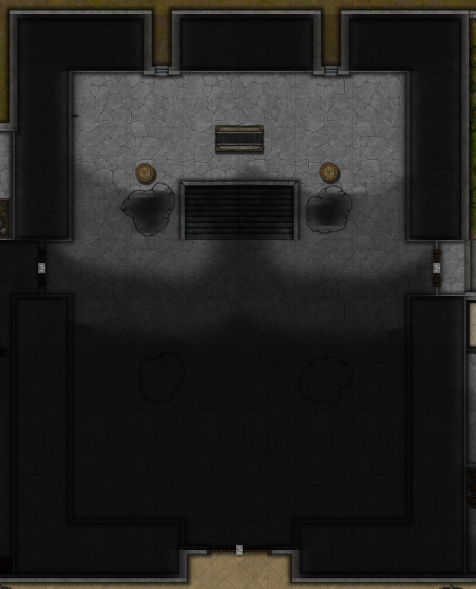
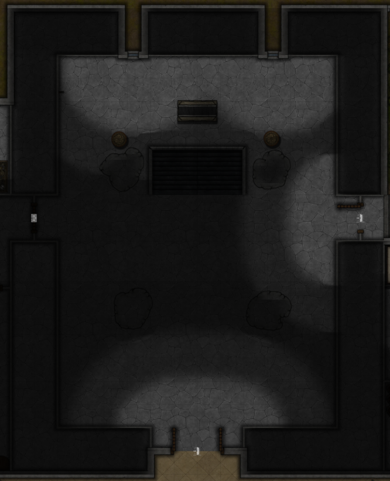

Light spill can be enabled/disabled in the mod's settings.

## Light level tooltip

A tooltip beside the pointer showing the light level under the cursor, or of a hovered token. **Alt+L**
toggles it by default.

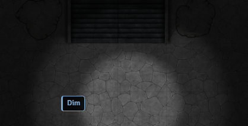

The tooltip can also provide context for the cause of a light level, such as "Dim · reduced from 
normal", "Bright · darkness cancelled by daylight", "seen through darkness", or "out of sight behind 
a wall" (GM only).

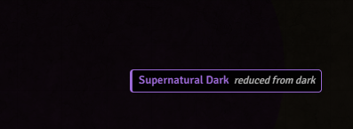

The tooltip reports what the view shows rather than what the scene holds, so ground the viewer 
cannot see reads **Dark** — a wall between the viewer and a point hides its light level the same way 
a magical darkness lowers it.

Hovering a token also shows its name. If a player does not have permission to read the nameplate of a 
token it instead reads `???`.

Token readouts sample the center plus four quarter-offset points and report the **brightest**, so a 
token straddling a light's edge reads its as lit.

## Token Vision

When enabled, a GM's view is restricted to what is visible to the selected token(s). This includes
lighting, fog, and other token visibility. It can be toggled from mod settings, a button under token 
controls, or a hotkey (**Alt+O** by default).

- **On** (default) - selecting a token as GM shows you what that token perceives.
- **Off** - you keep full GM vision regardless of selected tokens

This setting has no effect on non-GM users.

# Configuration

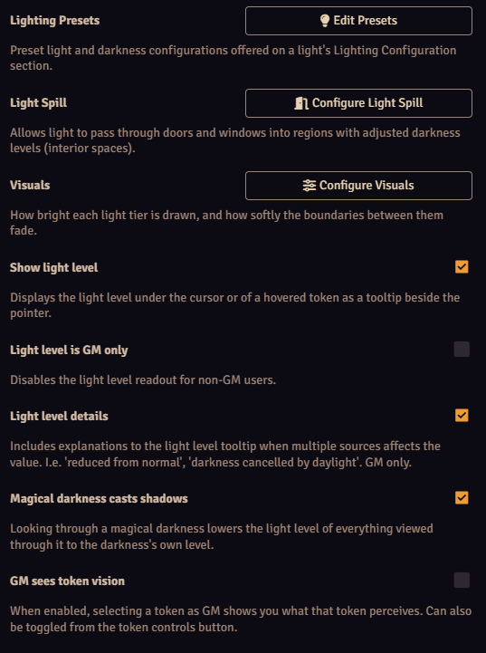

| Setting | Effect |
| --- | --- |
| **Light Sources** | Which items give off light when lit, and what they burn |
| **Lighting Presets** | Edit preset lighting configurations |
| **Light Spill** | Configure the effects of light spill |
| **Visuals** | Configure visual effects of lighting |
| **Fuel use** | Whether lit sources burn indefinitely, consume fuel, announce it, or both |
| **Show light level** | light level tooltip. **Alt+L** to toggle by default |
| **Light level is GM only** | Whether players can enable light level tooltip - on by default |
| **Light level details** | Tooltip lighting details. GM only |
| **Magical darkness casts shadows** | Umbra effect for magical darkness |
| **GM sees token vision** | GM only. Also **Alt+O** and a token-control toggle |

## Edit Light Sources

Which items give off light when they are lit, what they give off, and what they burn. The list
ships with Pathfinder's own kit - torches, candles, lamps, both lanterns, sunrods and everburning
torches - and an untouched world tracks that list as the mod changes it.

| Field | What it does |
| --- | --- |
| **Item name** | Matched against the item's name, ignoring capitalisation |
| **Also called** | Other names for the same thing, separated by semicolons |
| **Light preset** | What it gives off |
| **Fuel** | The item consumed while it burns, and how long one of them lasts |

Leave the fuel name blank and it burns indefinitely; name the item itself and it consumes itself,
the way a torch does.

Items are matched **by name**, so a world playing in another language, or with a differently named
lantern, edits the list here. An item that carries its own light settings on its **Advanced** tab
ignores the list entirely - see [Light on an item](#light-on-an-item).

## Edit Presets

You can add, duplicate, delete, and rename presets here. **Edit light** opens Foundry's own light
configuration sheet for the selected preset, so a preset can hold everything a placed light can -
radii, angle, rotation, colour, animation, and every advanced option - alongside this module's own
**Lighting Configuration** section.

Position fields are hidden, since a preset is not anywhere: coordinates and elevation, and the
elevation row Wall Height adds when it is installed.

Changes made in that sheet are held in the preset window and are only written when you press
**Save** there.

## Light Spill

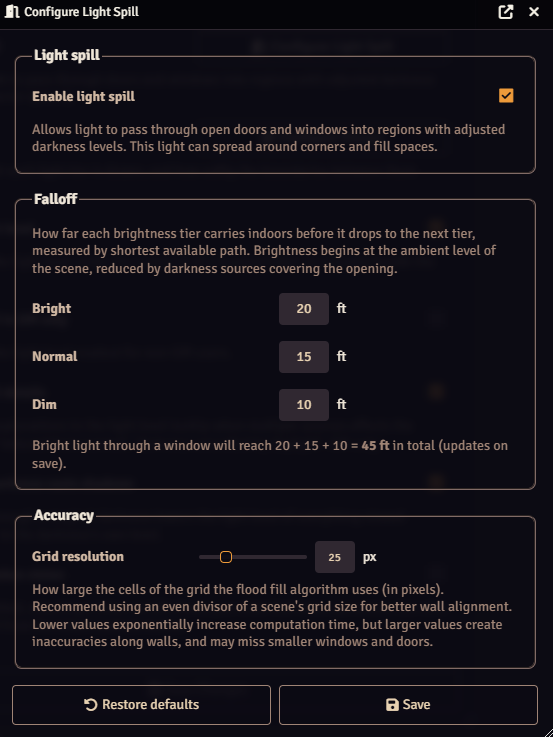

You can enable/disable light spill, set the falloff distance of each brightness level, and change
the grid resolution used to calculate it here.

Light falloff is cumulative, so a bright source spills bright light for the configured bright distance, 
then normal light for the configured normal distance, then dim light for the configured dim distance.

Grid resolution determines how fine the calculation for light spill is. It is highly recommended to
use an even multiple of a scene's grid size for increased accuracy (most walls follow grid lines - 
using an even multiple keeps it grid aligned and results in no induced error for said walls regardless
of resolution). Calculation time increases exponentially with smaller resolutions. Calculations only
occur when spill lighting is changed (changing global illumination, editing walls, or opening a door),
but calculation time can increase to several seconds with a small enough value.

## Visuals

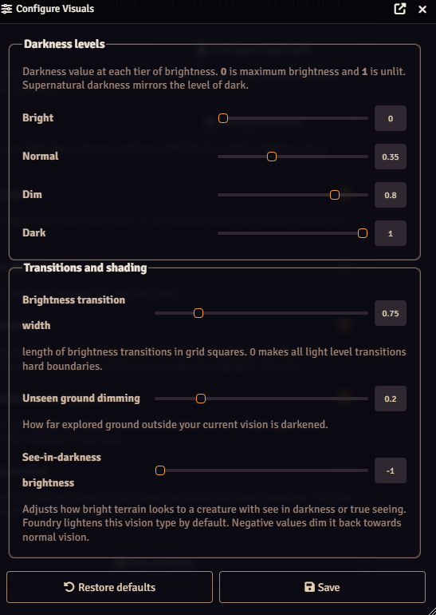

These changes are purely aesthetic, and have no impact on the underlying model that calculates light.

Four **Darkness levels** - Bright, Normal, Dim, Dark - set how dark the ground at each level is painted,
from 0 (full daylight) to 1 (unlit). Lower brightness levels should have higher values. Supernatural 
Dark is drawn at the same level as Dark and differentiated by the darkness effect's own overlay. These
settings change the brightness of light sources along with global illumination, so all light levels
maintain parity.

**Brightness transition width** gives the blurring effect between brightness levels. Setting to 0
makes every transition a sharp line.

**Unseen ground dimming** is how dark areas outside your field of view but previously explored are.
Default for core Foundry is 0.5, but this mod makes all areas outside your field of view dark, which
already acts to darken it. Areas hidden by fog remain black and are unaffected.

**See-in-darkness brightness** adjusts how bright terrain looks to a creature with *see in darkness* 
or *true seeing*. Foundry lightens this vision type by default; negative values dim it back toward 
a normal vision.

# Compatibility

This module **overrides Foundry's underlying lighting and vision systems**. It replaces how the scene 
is lit, how darkness is swept, how detection modes answer, how the darkness-level texture is painted, 
and how desaturation is applied.

**Anything else that touches Foundry's vision system is likely to conflict.** That includes modules 
that patch detection modes, replace vision or light source classes, draw their own lighting layer, 
or manipulate the darkness level directly.

# Performance

**Light spill can be an expensive feature.** It uses a flood-fill algorithm across an interior region's 
floor, and the cost rises with the region's area and the number of doors and windows along its border.

It is recomputed only when the lighting actually changes - a door opening or closing, a wall edited, 
the scene's ambient level moving, or a darkness crossing a window. It does **not** run per frame or 
per token move. Heavy wall editing on a map with several windows will likely be your worst case.

If a scene is slow:
- **Break large interiors into smaller regions.** One region per room costs far less than one region 
wrapping a whole floor plan.
- **Raise the Grid resolution number** in *Configure Light Spill*. It is the size of the flood-fill 
cell in pixels (default 25), so a **larger** number means fewer cells and less work. Lowering it 
increases cost exponentially. The images below show the difference between a 25 pixel and 5 pixel
fill - the 5 pixel fill takes 25 times as long to process. The example light fill image above uses
a 25 pixel fill algorithm - lighting is smoothed and does not show the pixelation, higher resolution
only matters for determining the accuracy of lighting lines along walls and other light barriers.

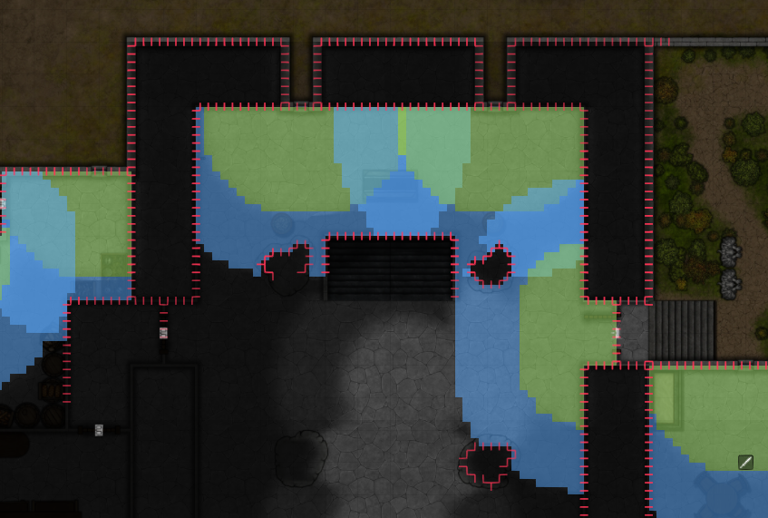

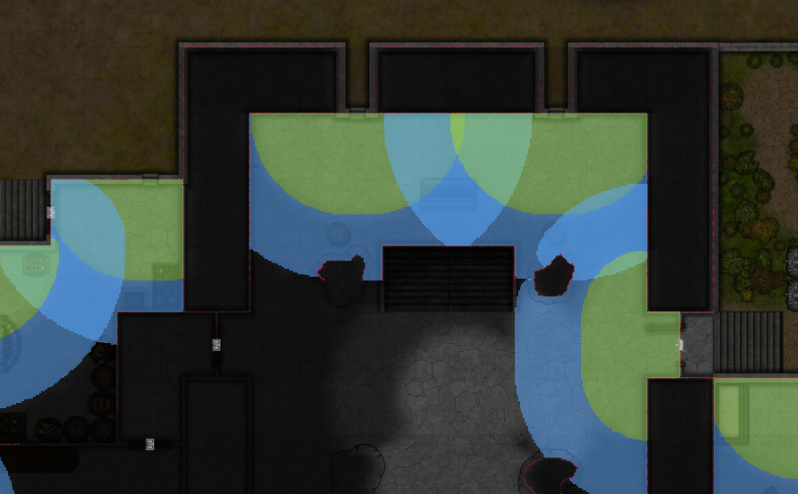

**Dragging many tokens at once as a GM with token vision on** can be another slowdown point. If token
vision animation is enabled, a token's vision model is re-calculated repeatedly as it moves across the
scene. If many tokens are selected, it recalculates for each of them, stacking additively. Turning
**Token Vision** off (**Alt+O** by default) prevents those calculations.

# More

- **[DEBUGGING.md](DEBUGGING.md)** - Many console commands were implemented in development of this
mod. They remain available for testing purposes if desired.
- **[API.md](API.md)** - An API is in place to provide lighting data for system automation in other
mods, such as light sensitivity, stealth checks, or concealment.